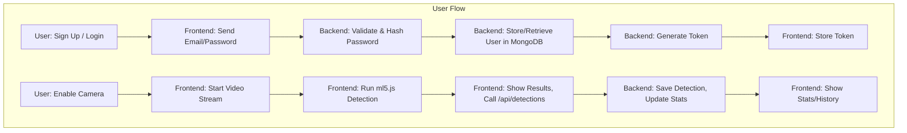

# 🤖 AI Object Detection

[](https://ai-object-detection-9nez.onrender.com)

---

## 🚀 Deployed Link
**Live Demo:** [https://ai-object-detection-9nez.onrender.com](https://ai-object-detection-9nez.onrender.com)

---

## 📚 Overview
AI Object Detection is a real-time, web-based application that uses machine learning (ml5.js, COCO-SSD) to detect objects from your device camera. It features user authentication, live statistics, detection history, and a modern, responsive UI.

---

## ✨ Features
- Real-time object detection (COCO-SSD, ml5.js)
- Multi-object, multi-class support
- User authentication (email/password)
- Live statistics and analytics
- Detection history and image capture
- Responsive design (desktop/mobile)
- Secure backend (Node.js, Express, MongoDB)

---

## 🏗️ System Architecture
**High-level overview:**

The system is composed of four main parts:
1. **User (Browser):** The end user interacts with the application through a modern web browser, which accesses the device camera for real-time video streaming.
2. **Frontend (HTML/JS/CSS, ml5.js):** The frontend is a single-page web app that handles the user interface, camera access, and runs the COCO-SSD object detection model in the browser using ml5.js. It also manages authentication, statistics, and history display.
3. **Backend (Node.js/Express):** The backend is a Node.js server using Express. It serves the frontend files, provides REST API endpoints for authentication, detections, stats, and captures, and manages user sessions and security.
4. **Database (MongoDB Atlas):** User data (such as email and hashed password) is securely stored in a managed MongoDB Atlas database. Detection and capture data is managed in-memory for demo purposes but can be extended to persistent storage.

**Data Flow:**
- The user’s browser streams video to the frontend, which performs AI detection locally.
- The frontend communicates with the backend via API calls for login, signup, stats, and history.
- The backend interacts with MongoDB for user management and can be extended for persistent detection/capture storage.

---

## 🏛️ System Design
**Main modules and their relationships:**

- **Frontend Modules:**
  - **UI (HTML/CSS/JS):** Handles all user interactions, forms, and display of detection results, stats, and history.
  - **ml5.js (COCO-SSD):** Runs the object detection model in the browser for real-time inference on video frames.
  - **Camera Access:** Uses browser APIs to access the device camera and stream video to the detection model.
  - **API Client:** Handles all HTTP requests to the backend for authentication, detections, stats, and captures.

- **Backend Modules:**
  - **Express Server:** Serves static frontend files and exposes REST API endpoints.
  - **Auth Module:** Manages user signup, login, password hashing, and token generation/validation.
  - **Detection API:** Receives detection/capture data from the frontend and manages in-memory storage (can be extended to DB).
  - **Stats/History API:** Provides endpoints for retrieving user-specific statistics and detection/capture history.
  - **MongoDB Client:** Handles all interactions with the MongoDB Atlas database for user data.

**Component Relationships:**
- The UI interacts with ml5.js for detection and with the API Client for backend communication.
- The API Client sends requests to the Express server, which routes them to the appropriate backend modules.
- The backend modules interact with MongoDB for persistent user data and can be extended for full detection/capture persistence.

---

## 📝 Low Level Design (LLD)
**Detailed flow for authentication and detection:**



---

## 🗂️ Tech Stack
- **Frontend:** HTML5, CSS3, JavaScript, ml5.js, COCO-SSD
- **Backend:** Node.js, Express.js, MongoDB Atlas
- **Deployment:** Render.com (full-stack)

---

## ⚙️ Installation

### Prerequisites
- Node.js 18+
- MongoDB Atlas account
- Git

### Local Setup
```bash
git clone <your-repo-url>
cd ai-object-detection
npm install
cp env.example .env # Add your MongoDB URI to .env
npm start
# Visit http://localhost:3000
```

---

## 🌐 Deployment
- **Backend & Frontend:** [Render.com](https://render.com)
- Add `MONGODB_URI` as environment variable
- Deploy and get your live link

---

## 🖥️ Usage
1. Sign up or log in with your email
2. Allow camera access
3. Enable AI detection
4. View real-time object detection
5. Capture images, view stats/history

---

## 🔒 Security
- Email/password authentication (bcrypt)
- CORS protection
- Environment variables for secrets
- HTTPS by default (Render)

---

## 🏛️ System Design Highlights
- **Stateless API**: All user state is in token/cookies
- **Scalable**: Can be containerized, deployed to cloud
- **Modular**: Frontend and backend can be split if needed

---

## 🤝 Contributing
1. Fork the repo
2. Create a feature branch
3. Commit changes
4. Open a pull request

---

## 📄 License
MIT License

---

## 🆘 Support
- [Open an issue](https://github.com/Divyanshu0230/AI-OBJECT-DETECTION/issues)
- [Live Demo](https://ai-object-detection-9nez.onrender.com)

---

**Built with ❤️ using AI and modern web technologies**
